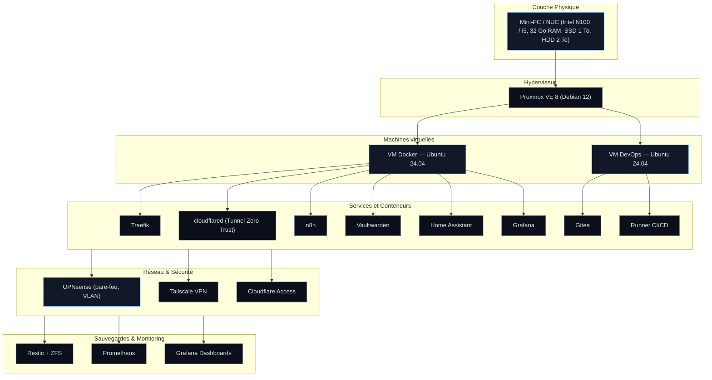
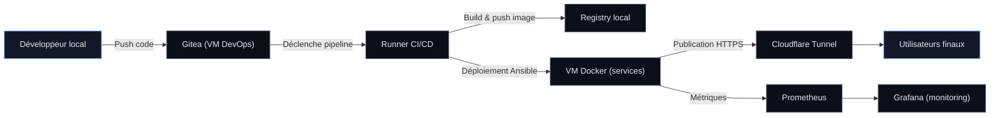
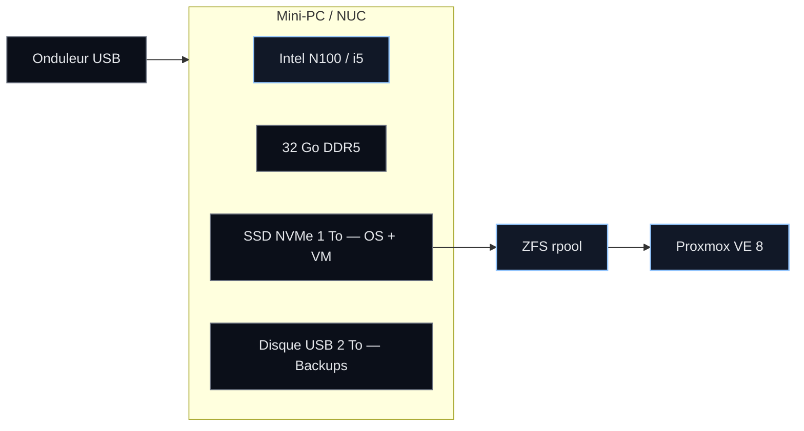
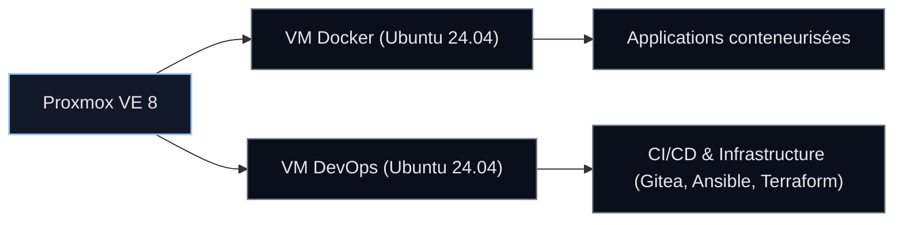
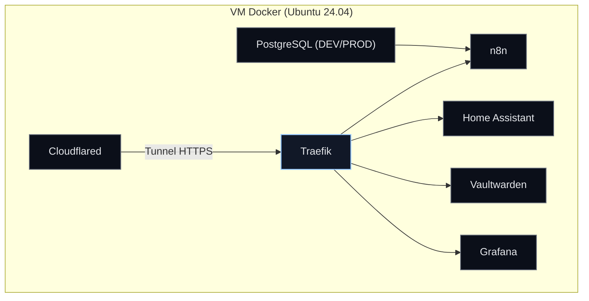
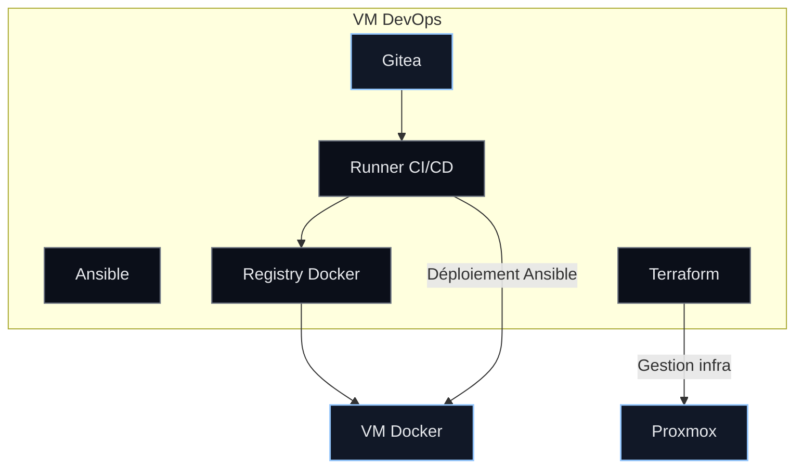
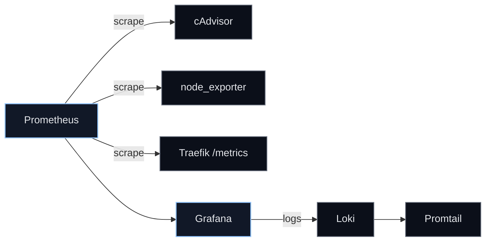
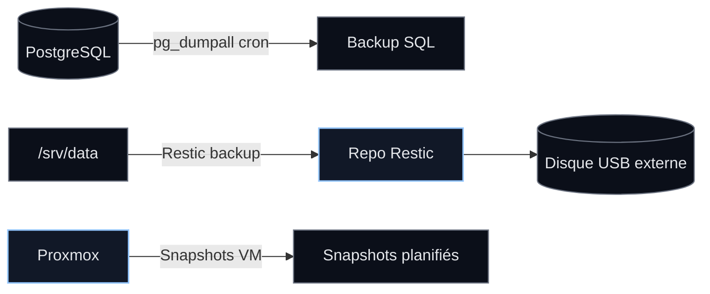
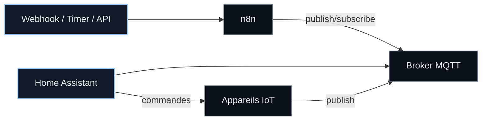
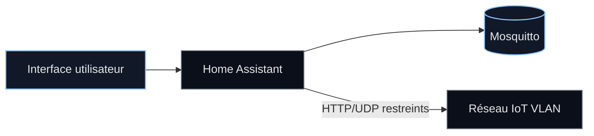

# Homelab Personnel

## Table des matières

- [Objectif global](#objectif-global)
- [Vue d’ensemble finale](#vue-densemble-finale)
  - [Vue verticale (couches)](#vue-verticale-couches)
  - [Vue horizontale (flux)](#vue-horizontale-flux)
- [Définitions des outils utilisés](#définitions-des-outils-utilisés)
- [Couche physique et stockage](#couche-physique-et-stockage)
- [Réseau et sécurité](#réseau-et-sécurité)

---

## Objectif global

Ce homelab a pour objectif de construire une infrastructure **sécurisée, modulaire et durable**, hébergée à domicile. Il vise à :

- héberger des sites web, API et services internes (n8n, Vaultwarden, Grafana) ;
- centraliser les outils personnels et professionnels ;
- tester des environnements DevOps, CI/CD, et des automatisations ;
- garantir la **sécurité, la fiabilité et l’isolation réseau** à chaque couche.

L’architecture repose sur un **hyperviseur Proxmox VE** hébergeant des machines virtuelles dédiées :
- une VM principale pour les services Docker (production et développement) ;
- une VM secondaire pour la partie DevOps (Gitea, Ansible, Terraform) ;
- un réseau cloisonné par VLAN géré par OPNsense ;
- un système de monitoring complet via Prometheus et Grafana ;
- une politique de sauvegardes via Restic et snapshots ZFS.

Cette structure s’inspire d’une approche professionnelle (type cluster d’entreprise) tout en restant accessible sur du matériel personnel à faible consommation.

---

## Vue d’ensemble finale

### Vue verticale (couches)



### Vue horizontale (flux)



---

## Définitions des outils utilisés

### Proxmox VE
**Proxmox Virtual Environment** est un hyperviseur open-source basé sur Debian, conçu pour héberger et gérer des machines virtuelles (KVM) et des conteneurs (LXC). Il offre une interface web complète, la gestion des snapshots, des sauvegardes automatiques et la haute disponibilité. Dans ce homelab, Proxmox sert d’ossature à toute l’infrastructure virtuelle.

### Docker / Docker Compose
**Docker** permet de déployer des applications dans des conteneurs isolés. **Docker Compose** orchestre plusieurs conteneurs via un fichier YAML, simplifiant la configuration, le réseau et le stockage des services. Tous les services applicatifs du homelab (Traefik, Grafana, Vaultwarden, etc.) sont gérés via Compose.

### Traefik
**Traefik** est un reverse proxy moderne qui gère automatiquement le routage HTTP/HTTPS et l’obtention de certificats SSL via Let’s Encrypt. Il est utilisé ici pour rediriger les requêtes Cloudflare Tunnel vers les bons services Docker internes, avec gestion automatique des sous-domaines.

### Cloudflare Tunnel / Zero-Trust
**Cloudflare Tunnel** permet d’exposer des applications locales sur Internet sans ouvrir de ports. Associé à **Cloudflare Zero-Trust**, il ajoute une couche d’authentification (SSO, MFA) et un WAF intégré. Dans ce projet, il connecte de manière sécurisée la VM Docker à Internet.

### Tailscale
**Tailscale** est un VPN basé sur WireGuard, qui relie tous les appareils du réseau personnel via un maillage chiffré. Il offre un accès SSH et administratif privé au homelab, sans configuration complexe.

### Vaultwarden
**Vaultwarden** est une alternative open-source à Bitwarden, utilisée pour gérer les mots de passe et secrets de manière chiffrée. Il stocke les accès des services et variables sensibles de déploiement.

### n8n
**n8n** est un moteur d’automatisation de workflows low-code. Il sert à automatiser des tâches répétitives (sauvegardes, synchronisations, alertes) et à interagir avec d’autres services internes ou externes.

### Home Assistant / MQTT
**Home Assistant** centralise la gestion domotique. Couplé à **Mosquitto (MQTT)**, il permet la communication entre objets connectés (ampoules, capteurs, caméras) et le reste du réseau. Le VLAN IoT est isolé pour des raisons de sécurité.

### Gitea
**Gitea** est une plateforme Git auto-hébergée, équivalente à GitHub, légère et simple. Elle gère le versioning du code et déclenche les pipelines CI/CD via des Runners intégrés.

### Ansible / Terraform
**Ansible** automatise la configuration et le déploiement des services via SSH. **Terraform** gère l’infrastructure (VM, DNS, Cloudflare) de manière déclarative. Ensemble, ils assurent la cohérence et la reproductibilité du homelab.

### Prometheus / Grafana / Loki
**Prometheus** collecte les métriques systèmes et conteneurs. **Grafana** les visualise dans des tableaux de bord. **Loki** centralise les logs, offrant un monitoring complet et corrélé (métriques + logs).

### Restic / ZFS
**Restic** est un outil de sauvegarde dédupliqué, sécurisé et automatisé. Couplé à **ZFS**, qui assure l’intégrité des données, ils garantissent la résilience du système et la possibilité de restaurations rapides via snapshots.

---

## Couche physique et stockage

Cette section décrit la base matérielle du homelab, élément fondamental pour la stabilité et la performance de l’ensemble.

### Configuration matérielle

| Élément | Spécification |
|----------|---------------|
| Processeur | Intel N100 (4 cœurs / 4 threads, 3.4 GHz boost) ou Intel i5-1240P (12 cœurs hybrides) |
| Mémoire | 32 Go DDR5 (2×16 Go) — ECC si possible |
| Stockage principal | SSD NVMe 1 To (OS + VM) |
| Stockage secondaire | HDD USB 2 To (backups Restic) |
| Alimentation | Onduleur USB pour extinction automatique |
| OS principal | Debian 12 + Proxmox VE 8 |
| Réseau | Ethernet 2.5 Gbps, VLAN supportés via OPNsense |
| Consommation | 12–20 W au repos / 45 W en charge |

### Organisation du stockage

| Volume | Type | Emplacement | Usage |
|--------|------|-------------|-------|
| local | ZFS pool (SSD NVMe) | `/rpool/data` | OS Proxmox + ISOs + Templates |
| local-lvm | LVM-thin (SSD NVMe) | `/dev/pve/data` | Disques virtuels VM/CT |
| backups | HDD externe (USB) | `/mnt/usb-backups` | Snapshots + backups Restic |
| iso-store | Dataset ZFS | `/rpool/iso` | Images ISO / installation |
| logs | Dataset ZFS | `/rpool/logs` | Logs système et VM |

### Schéma physique



---

## Réseau et sécurité

Le réseau est divisé en VLANs afin d’isoler les environnements (LAN, serveurs, IoT). Cette segmentation empêche toute compromission croisée et renforce la sécurité.

### Schéma VLAN

| VLAN | IP Range | Usage | Accès autorisé |
|------|-----------|--------|----------------|
| VLAN 10 | 192.168.10.0/24 | LAN (PC, téléphones) | Internet, UI via Cloudflare |
| VLAN 20 | 192.168.20.0/24 | SERVERS (Proxmox, Docker, n8n) | VPN + Zero-Trust |
| VLAN 30 | 192.168.30.0/24 | IOT (ampoules, TV, capteurs) | Accès sortant vers MQTT/HA uniquement |

### Pare-feu OPNsense

```
LAN → SERVERS : DENY
IOT → SERVERS : DENY
IOT → LAN : DENY
SERVERS → IOT : ALLOW (ports limités)
LAN → SERVERS : ALLOW (UI HA/Grafana via Cloudflare Access)
VPN (Tailscale) → SERVERS : ALLOW ALL
SERVERS → INTERNET : ALLOW HTTPS, DNS
```

### Sécurité d’accès

- Tailscale pour l’accès administrateur (SSH, Proxmox, Grafana, etc.)
- Cloudflare Zero-Trust pour l’exposition publique (auth SSO + WAF + SSL)
- Traefik gère le HTTPS interne via ACME (Cloudflare DNS API)
- Aucun port n’est ouvert sur la box Internet

---


## Virtualisation et VM

Cette section décrit la structure logique des machines virtuelles gérées par Proxmox et leur rôle dans le fonctionnement du homelab.

### Structure Proxmox

| Nom | OS | Rôle principal | Détails |
|------|----|----------------|----------|
| proxmox-node1 | Debian 12 + Proxmox VE 8 | Hôte principal | Gestion des VM, snapshots, stockage ZFS |
| vm-docker | Ubuntu Server 24.04 | Hébergement des services et sites web via Docker | Conteneurs : Traefik, n8n, Grafana, Vaultwarden, PostgreSQL |
| vm-devops | Ubuntu Server 24.04 | Gestion CI/CD et infrastructure | Gitea, Runners, Ansible, Terraform, Registry Docker |

### Pourquoi Proxmox ?

Proxmox VE est choisi pour sa stabilité, sa gestion fine des ressources et sa flexibilité :
- isolation complète entre les VM (sécurité accrue) ;
- snapshots instantanés et restauration en quelques secondes ;
- possibilité d’évolution vers un cluster multi-nœuds ;
- intégration native avec ZFS pour la résilience du stockage ;
- interface web et API modernes facilitant l’administration.

Cette couche agit comme fondation pour tout le reste de l’infrastructure, en offrant la portabilité et la possibilité d’expérimenter sans risque.

### Schéma Proxmox



---

## VM Docker — Développement et Production

Cette VM héberge tous les services applicatifs dans des conteneurs Docker orchestrés via Docker Compose. Elle regroupe à la fois les environnements de développement (DEV) et de production (PROD).

### Organisation des répertoires

```
/srv/docker/
  traefik/
    traefik.yml
    acme.json
  cloudflared/
    config.yml
  myapp-dev/
    docker-compose.yml
    .env.dev
  myapp-prod/
    docker-compose.yml
    .env.prod
/srv/data/
  myapp-dev/
  myapp-prod/
  postgres-dev/
  postgres-prod/
```

### Caractéristiques principales

- un seul Traefik et un seul Cloudflared gèrent tous les flux entrants ;
- réseaux séparés : `web-dev` et `web-prod` ;
- deux bases PostgreSQL isolées (dev/prod) ;
- noms de domaines distincts : `dev.myapp.domain.fr` et `myapp.domain.fr` ;
- aucun port n’est exposé directement, tout passe par Cloudflare Tunnel.

### Exemple de configuration Traefik (extrait)

```yaml
services:
  myapp:
    labels:
      - "traefik.enable=true"
      - "traefik.http.routers.myapp.rule=Host(`myapp.domain.fr`)"
      - "traefik.http.routers.myapp.entrypoints=websecure"
      - "traefik.http.routers.myapp.tls=true"
      - "traefik.http.services.myapp.loadbalancer.server.port=8080"
    networks: [web-prod]
```

### Schéma VM Docker



---

## VM DevOps — CI/CD et Orchestration

Cette VM est dédiée à la gestion du code, aux déploiements automatisés et à la supervision de l’infrastructure.

### Outils principaux

| Outil | Rôle |
|--------|------|
| Gitea | Plateforme Git auto-hébergée pour versionner le code |
| Runner Gitea | Exécution automatique des pipelines CI/CD |
| Ansible | Automatisation des déploiements et configuration des services |
| Terraform | Provisionnement de l’infrastructure (VM, DNS Cloudflare) |
| Registry Docker | Stockage interne des images Docker buildées |

### Exemple de pipeline CI/CD

```yaml
name: Deploy Application

on:
  push:
    branches: [ main, develop ]

jobs:
  build-and-deploy:
    runs-on: self-hosted
    steps:
      - name: Checkout code
        uses: actions/checkout@v3

      - name: Build Docker image
        run: docker build -t registry.local/myapp:${GITHUB_SHA} .

      - name: Push image to registry
        run: docker push registry.local/myapp:${GITHUB_SHA}

      - name: Deploy with Ansible
        run: ansible-playbook -i inventories/prod/hosts.ini deploy_app.yml
```

### Schéma VM DevOps



---

## Workflow CI/CD Hybride

Le workflow hybride combine le confort du développement local avec la fiabilité du déploiement automatisé via le homelab.

### Étapes du cycle complet

1. Le développeur code localement et teste via `docker-compose.dev.yml`.
2. Un push sur Gitea déclenche le pipeline CI/CD.
3. Le Runner build l’image et la pousse dans le registry local.
4. Ansible déploie automatiquement l’image dans l’environnement DEV.
5. Une fois validée, la fusion sur `main` déclenche un déploiement en PROD.

### Schéma du workflow


---


## Sécurité et gestion des accès

La sécurité est au cœur de l’architecture. Tous les accès administratifs et publics sont protégés par des solutions modernes et sans ports ouverts.

### Accès administratifs

- **Tailscale** fournit un VPN chiffré (WireGuard) pour accéder à Proxmox, aux VM et à Grafana.
- Les clés SSH remplacent totalement les mots de passe.
- Accès web à Proxmox restreint au VLAN 20.

### Accès publics

- **Cloudflare Tunnel** établit une connexion HTTPS sortante sécurisée.
- **Cloudflare Zero-Trust** assure l’authentification SSO (Google/GitHub) et le filtrage WAF.
- Aucun port n’est ouvert sur la box Internet.

### Secrets et variables

- Tous les secrets sont stockés dans **Vaultwarden**.
- Les environnements `.env.prod` sont chiffrés via **Ansible Vault**.
- Les fichiers `.env.dev` restent locaux pour le développement.

### Schéma d’accès sécurisé


---

## Monitoring et observabilité

La supervision permet de mesurer l’état global du système, d’anticiper les problèmes et de garantir la stabilité.

### Outils mis en place

| Outil | Fonction |
|--------|-----------|
| **Prometheus** | Collecte les métriques des conteneurs, du système et du réseau |
| **cAdvisor** | Expose les statistiques Docker |
| **node_exporter** | Remonte les métriques CPU, RAM, disques des VM |
| **Grafana** | Centralise et visualise toutes les données collectées |
| **Loki + Promtail** | Centralise les logs Docker et permet leur corrélation avec les métriques |
| **Uptime Kuma (option)** | Surveille la disponibilité externe des services |

### Schéma de supervision



---

## Sauvegardes et restauration

### Stratégie de sauvegarde

| Type | Outil | Fréquence | Cible |
|------|--------|------------|--------|
| Snapshots VM | Proxmox | Hebdomadaire | SSD local |
| Fichiers Docker (volumes) | Restic | Quotidien | HDD USB externe |
| Bases de données | Cron SQL Dump | Quotidien | `/srv/backups` |
| Configuration OPNsense | Auto-backup | Hebdomadaire | Git privé (Tailscale) |

### Schéma des sauvegardes



### Politique de rétention

| Environnement | Durée de rétention |
|----------------|--------------------|
| DEV | 7 jours |
| PROD | 30 à 90 jours |

### Vérification automatique

- `restic check` exécuté chaque nuit via cron.
- Tests de restauration ponctuels réalisés manuellement.

---

## Maintenance et évolutions

### Automatisation

Des scripts Ansible et Makefile facilitent l’entretien du système :
- mise à jour automatique des conteneurs (`docker compose pull && up -d`) ;
- rotation et purge des logs ;
- vérification de la santé des services (`docker ps`, `restic check`) ;
- redémarrage planifié des VM.

### Évolutions futures

- Migration vers **k3s** (Kubernetes léger) pour la scalabilité ;
- Passage à un modèle **GitOps** via **ArgoCD** ou **FluxCD** ;
- Mise en place d’un **cluster Proxmox** multi-nœuds ;
- Ajout d’un **monitoring réseau** (Zabbix / ntopng) ;
- Intégration d’une **CI/CD complète** pour tous les projets hébergés.

---

## Annexes — Schémas complémentaires

Cette section regroupe les anciens schémas détaillés du système (stockage, réseau, automatisation, etc.), adaptés au thème sombre pour garantir la lisibilité.

### Automatisation (n8n & Home Assistant)



### Domotique (Home Assistant)



### Stockage de secrets (Vaultwarden)


---

## Résumé final

| Couche | Technologie clé | Rôle |
|---------|----------------|------|
| Réseau | OPNsense + VLAN | Isolation et sécurité |
| Virtualisation | Proxmox VE | Gestion des VM et conteneurs |
| VM Docker | Ubuntu 24.04 + Docker | Hébergement des services applicatifs |
| VM DevOps | Ubuntu 24.04 + Gitea | CI/CD et automatisation des déploiements |
| Sauvegardes | Restic + ZFS | Résilience et restauration rapide |
| Monitoring | Prometheus + Grafana | Observabilité et alertes |

---

